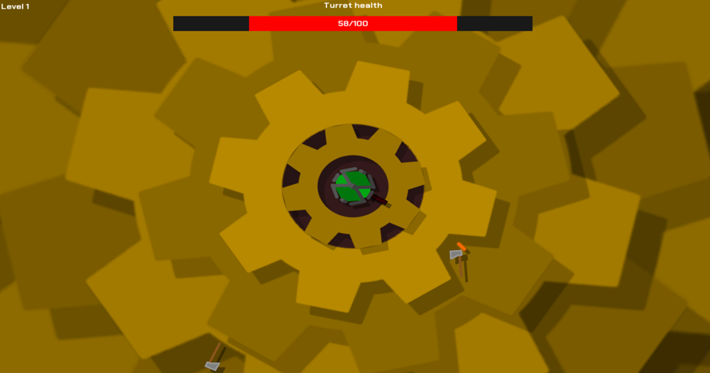

# Turret Siege

Open source rougelike game where you are a turret surrounded by enemies. Longer you survive, the better you score.

Made with [Love2D](https://love2d.org/) and [LovePotion](https://lovebrew.org/) in Lua.

<!-- [View on itch.io](https://wolfyxon.itch.io/turretsiege) -->

## Screenshots



## Platforms
| Platform     | File formats     | Architectures | Status   |
| ------------ | ---------------- | ------------- | -------- |
| Universal    | `love`           | *             | ✅       |
| Linux        | `AppImage`       | x86_64        | ✅       |
| Windows      | `exe`            | x86_64 x86_32 | ✅✅     |
| Nintendo 3DS | `3dsx` ~~`cia`~~ |               | ⚠️📁     |
| MacOS        |                  |               | 📁       |
| Android      |                  |               | 📁       |

✅ `supported` | ⚠️ `unstable` | ❌ `unsupported` | 🕛 `in progress` | 📁 `planned` 

[Downloads](https://github.com/Wolfyxon/TurretSiege/releases/latest)

## Building and debugging
### With Lover (recommended)
This project uses [Lover](https://github.com/Wolfyxon/lover). 
```
lover run
```
```
lover build
```
```
lover build linux win64
```

Refer to the [wiki](https://github.com/Wolfyxon/lover/wiki) for more info.

### Running manually

To test the game without using the Makefile with `love`, start a terminal in the repository directory then run:
```
love src
```

### Manual building
Refer to the [Love2D wiki](https://love2d.org/wiki/Game_Distribution) and [LovePotion wiki](https://lovebrew.org/#/packaging?id=fused-binary).

### LovePotion bundler
You may use the [LovePotion bundler](https://bundle.lovebrew.org/) for Nintendo consoles but it's not officially supported and will require making a config file.
